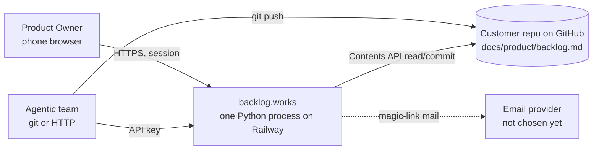
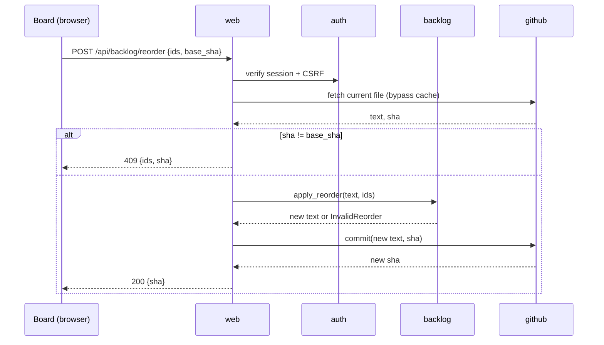

# backlog.works Architecture

One page, kept current. Two states are recorded: **as-is** (what is deployed
today) and **next** (the shape the first four backlog items land in). Rules
below are enforced by `scripts/check_architecture.py`, which runs inside
`scripts/check.sh`. When the code and this page disagree, the gate fails
and one of them is fixed in the same commit.

Why this exists before any product code: Crest, the product this was
extracted from, grew two root files of 1,800 and 5,500 lines and had to
retrofit a package boundary as "migration debt" with no paying customer yet.
Here the boundary comes first and is mechanical from line one.

## 1. Context



The backlog **file in the customer's repo is the only source of truth**.
backlog.works holds no copy of record; it holds sessions, API keys, and a
short-lived read cache.

## 2. As-is (deployed 2026-09-25)

| Block | Where | State |
|---|---|---|
| Process entrypoint | `src/backlogworks/__main__.py` | wires `Config` into `web.serve` |
| Config | `src/backlogworks/config.py` | `PORT` only |
| HTTP | `src/backlogworks/web/server.py` | stdlib `ThreadingHTTPServer`; `GET /` placeholder, `GET /healthz`, HEAD, 404 |
| Backlog domain | `src/backlogworks/backlog/` | empty package, responsibility declared |
| GitHub adapter | `src/backlogworks/github/` | empty package, responsibility declared |
| Auth | `src/backlogworks/auth/` | empty package, responsibility declared |
| Storage | none | no database yet |
| Build/deploy | `Dockerfile` (`python:3.12-slim`), `railway.json`, `scripts/deploy.sh` | one Railway service, `backlog.works` custom domain live |
| Gate | `scripts/check.sh` | backlog format, architecture, compile, smoke, skills, secret grep |

Zero third-party dependencies. One deployable. One environment (production).

## 3. Next (target for PBI-001 to PBI-004)

Same single process, four building blocks filled in, one small database.

| Block | Responsibility | Fed by |
|---|---|---|
| `backlog` | parse the `| PBI-` table; status legend; validate reorder (same id set, same per-row cell count, rows unchanged) and single-cell status change; produce the new file text. Pure functions, no I/O. | PBI-001 (Extract backlog source module) |
| `github` | `GET`/`PUT /repos/{owner}/{repo}/contents/{path}`; ETag read cache; commit with blob `sha` as optimistic-concurrency guard; 409 surfaces to caller. Only module with network egress to GitHub. | PBI-001 (Extract backlog source module) |
| `web` | routes: `GET /` landing, `GET /b/{repo}` board page, `GET /api/backlog`, `POST /api/backlog/reorder`, `POST /api/backlog/status`, sign-in routes; response headers (`noindex`, `no-store`); CSRF check; board HTML+JS asset inlined from `web/assets/` | PBI-002 (Extract renderer/board), PBI-003, PBI-004 |
| `auth` | magic-link sign-in and PO session cookie (`__Host-` prefix, sliding expiry); API keys per repo, hashed at rest, same write validation as the session path; CSRF token = HMAC(session) | PBI-003 (Standalone sign-in), PBI-004 (API key for agents) |
| `config` | every env var in one dataclass: `PORT`, `BASE_URL`, `GITHUB_TOKEN`, `GITHUB_REPO`, `BACKLOG_PATH`, `BACKLOG_BRANCH`, `SESSION_SECRET`, `DATABASE_PATH`, mail settings | each PBI adds its fields |
| Storage | SQLite file on a Railway volume, owned by `auth` (sessions, API keys, magic-link tokens). Nothing about backlog content is stored. | PBI-003 |

Multi-tenant (many customer repos) is **out of the next state**. First
target is one configured repo; the data model (`repo` column on keys and
sessions) is shaped so a second repo is a config change, not a rewrite.

### Dependency rule (enforced)

```
__main__ -> config, web
web      -> backlog, github, auth, config
github   -> backlog, config
auth     -> config
backlog  -> (nothing internal)
config   -> (nothing internal)
```

Arrows point one way. `backlog` never learns about HTTP or GitHub; `github`
never learns about sessions; `web` is the only place the three meet.

### Sequence: Product Owner reorders from the phone



The agent API-key path is the same sequence with `A` verifying a key
instead of a session.

## 4. Rules

1. **Stdlib only** until a dependency is approved by the Product Owner in a
   report. Rationale: zero supply-chain surface for a product that holds a
   write token to a customer's repo.
2. **One process, one image, one config dataclass.** No second service,
   worker, or queue in the next state. `os.environ` is read only in
   `config.py` (gate).
3. **Dependency rule above is law** (gate). New building block = a row in
   section 3, an entry in the checker's matrix, same commit.
4. **File size cap 600 lines** per Python file (gate). Split by
   responsibility, not by number.
5. **Root allowlist** (gate): only `AGENTS.md`, `CLAUDE.md`, `Dockerfile`,
   `LICENSE`, `README.md`, `railway.json`, `.gitignore` at the root; code
   under `src/`, tests under `tests/`, tooling under `scripts/`.
6. **No backlog content at rest** in backlog.works. Cache is in-memory and
   bounded by ETag; the repo is authoritative and a restart loses nothing.
7. **Writes are validated twice**: the pure `backlog` functions refuse any
   change beyond the requested operation, and GitHub's `sha` refuses stale
   bases. Direct commit to the configured branch, no PR, single-file blast
   radius. Same validation for humans and agents.
8. **Tests live next to the block** in `tests/<block>/`, `unittest`, no
   sockets (patch `urllib`), wired into `scripts/check.sh` with the first
   test.
9. **Secrets** never in repo, image, or logs; see
   `.agents/skills/backlog-works-secrets/SKILL.md`.

## 5. Decisions log

| Date | Decision | Why | Revisit when |
|---|---|---|---|
| 2026-09-25 | Modular monolith in one package, four blocks, enforced import matrix | Crest's retrofit cost; product is small | a second deployable is genuinely needed |
| 2026-09-25 | Source of truth is the customer's file via GitHub Contents API, direct commit to branch | product thesis (README "Why"); no sync problem | customers need PR-based review of backlog edits |
| 2026-09-25 | Stdlib only, Python 3.12 image | supply-chain surface; deploy path already proven | a real need (e.g. TLS client features) is named |
| 2026-09-25 | SQLite on a Railway volume for auth state only | one process, tiny write volume, nothing irreplaceable | multi-instance or multi-region |
| 2026-09-25 | Single-tenant first, tenant column from day one | ship PBI-001..004 fast without a rewrite later | second customer repo |
| 2026-09-25 | Placeholder server moved from `app/main.py` to `src/backlogworks/web/server.py` | skeleton before code, not after | never |

## 6. Known debt

None in code. Process debt: the Bitwarden helper is borrowed from Crest's
checkout (`backlog-works-secrets` skill); a repo-local helper is due when
the second secret appears.
