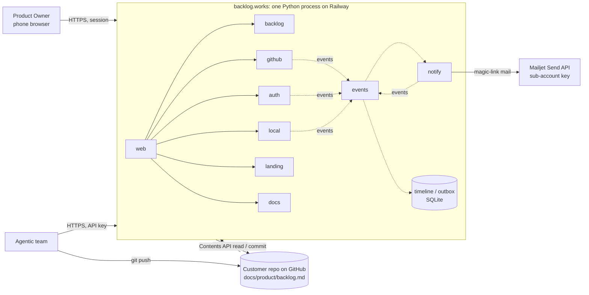
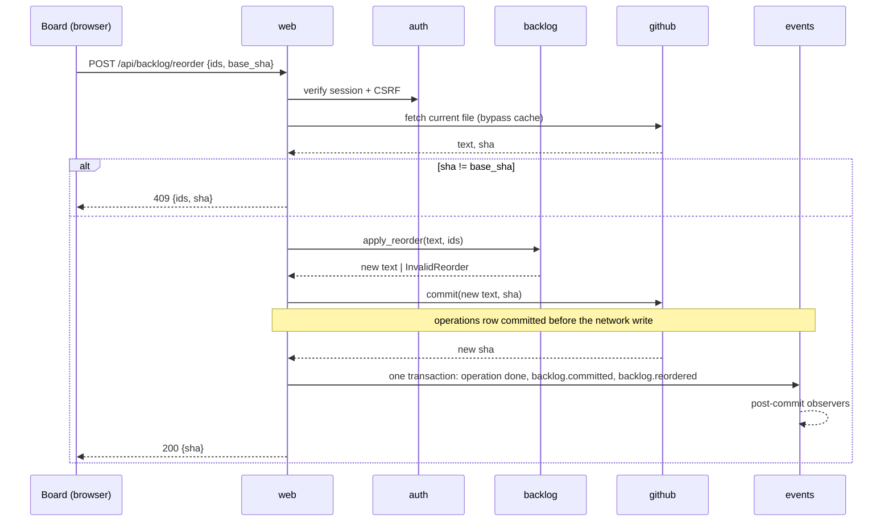

# backlog.works Architecture

One page, kept current. It records the **as-is** (deployed) shape and the
**next** shape (what J709 to F196 land in), as an **event-driven
modular monolith**: one process, one image, one database file, a set of
blocks that call *down* the dependency graph and talk *up and sideways only
through events*. The whole product lives in that one monolith: the app,
the public landing, and the product documentation.

`scripts/check_architecture.py` (inside `scripts/check.sh`) enforces the
block list, the import matrix, where the environment and the network may
be touched, a per-file size cap, and the root allowlist. Consistency
between this page and the code is a review duty at every structural
commit; the gate catches the mechanical part.

Why this exists before product code: Crest, the product this was extracted
from, grew two root files of 1,800 and 5,500 lines and retrofitted a
package boundary as "migration debt" before it had a paying customer. Here
the boundaries are mechanical from the first line.

## 1. Context



Each tenant has **exactly one source of truth for its backlog file**,
chosen at onboarding: a file in the tenant's GitHub repo (the first
adapter), or a document hosted by backlog.works (PO direction 2026-09-26:
the repo file is one usage scenario, not the only one). The `backlog`
block defines the `BacklogSource` port (`read() -> (text, version)`,
`write(text, base_version) -> version`); `github` and the hosted store are
adapters. backlog.works keeps identity, the event timeline, hosted
documents for tenants that chose hosting, and an in-memory read cache.

## 2. Blocks

All under `src/backlogworks/`. A block is a package (or, for `config` and
`__main__`, a single module) whose docstring states its responsibility; the
docstring is the contract. "As-is" means implemented in this checkout;
what is deployed is evidenced separately in `docs/ops/`.

| Block | Responsibility | Publishes | Subscribes | As-is | Next |
|---|---|---|---|---|---|
| `config` | every env var, read once into one frozen dataclass | | | `PORT`, `BACKLOG_FILE` | `BASE_URL`, `GITHUB_*`, `GITHUB_WEBHOOK_SECRET`, `BACKLOG_PATH`, `SESSION_SECRET`, `DATABASE_PATH`, `MAILJET_API_KEY`, `MAILJET_API_SECRET`, `MAIL_FROM` |
| `events` | `Event` envelope, `EventBus` (sync, in-process, registration-ordered, subscriber-isolated), audit sink; next: the append-only `events` table (timeline) and the generic `outbox` table with a transactional staging API and lease/ack API | `events.handler_failed` | | bus + stderr audit | timeline append, outbox staging and leasing |
| `backlog` | file format as data: parse table, items; validate reorder and single-cell status change; emit new text; the `BacklogSource` port (Protocol, no I/O). **Pure, no internal imports.** | | | parse | reorder / status change, port (J709) |
| `github` | `BacklogSource` adapter: Contents API read (ETag cache) and commit (blob `sha` guard); `push` webhook receiver with signature check | `backlog.loaded`, `backlog.committed`, `backlog.commit_conflicted`, `backlog.file_changed` | `backlog.file_changed` (drop cache) | empty | J709 |
| `auth` | magic-link sign-in, PO session cookie, CSRF, per-repo API keys; owns its tables; stages the private mail job through the events outbox API in the same transaction as its state | `auth.signin_requested`, `auth.signed_in`, `auth.signed_out`, `auth.key_issued`, `auth.key_revoked`, `auth.key_used` | | empty | N835, F196 |
| `notify` | delivery worker: leases mail jobs from the events outbox, sends via the Mailjet Send API (HTTPS), acks; retries with backoff and dead-letters; never called directly, never reads another block's tables | `notify.sent`, `notify.failed` | outbox jobs of kind `mail`; `backlog.item_status_changed` (stages a PO digest job) | empty | N835 |
| `local` | this product's own backlog file read from disk (`Config.backlog_file`, default `docs/product/backlog.md`, copied into the image); a `BacklogSource`-shaped read, no write | `backlog.loaded` (`sha` = content hash) | | served on `/` as `priaby/backlog-works` | superseded by the `github` adapter for this repo with J709 |
| `landing` | pitch chrome only; `/` is this product's own backlog rendered by the one board engine (`web.board`), never a second implementation | | | pitch above the board | G761 (Brand and landing page) |
| `docs` | product documentation at `/docs/*` from markdown packaged in the image | | | empty | first pages: file format and status legend (with J709), API reference (with F196) |
| `web` | routes, the single board engine (`board.py`), JSON endpoints, SSE, headers, CSRF check; the only place blocks meet | `backlog.reordered`, `backlog.item_status_changed` | `backlog.*` (SSE fan-out) | `/` (pitch + this repo's board), `/backlog.md`, `/healthz` | tenant boards, API, sign-in |
| `__main__` | composition root: build bus, subscribe consumers, construct server, publish `service.started`, serve | `service.started` | | | |

### Dependency rule (enforced)

```
__main__ -> config events web notify auth github        (wiring only)
web      -> backlog github auth local landing docs events config
github   -> backlog events config
local    -> backlog events config
auth     -> events config
notify   -> events config
landing  -> config
docs     -> config
events   -> config
backlog  -> (nothing)
config   -> (nothing)
```

Direct calls go down this list. Anything that would need to go up or
sideways (auth wanting mail sent, github wanting the cache dropped, web
wanting a timeline entry) is an event or an outbox job instead. `web` is
the composition surface for a request and `__main__` for the process; every
other block imports at most `backlog`, `events`, `config`.

## 3. Event model

### Envelope

`Event(event_id, schema_version, name, payload, actor, repo, occurred_at)`.
Facts, past tense, immutable, JSON data only (validated and snapshotted at
construction; payload nested under `payload`, never merged into the
envelope). `repo` is the tenant; `actor` is `system`, `po:<session id>`,
or `agent:<key id>`. Never a bearer token, an email address, or file
content in a payload; hashes and ids only.

### Two kinds of effects

1. **Mandatory recording** happens inside the command's transaction, not
   in a subscriber: the state change, the timeline append, and any
   required outbox job commit together or not at all. A failure here fails
   the command with an explicit error.
2. **Optional observers** (audit sink, cache drop, metrics) run after the
   commit, synchronously in the publishing thread, in registration order,
   each isolated: a failing observer is recorded as `events.handler_failed`
   (stable handler id and exception class only) and never affects the
   command or the other observers. The failure sink itself is guarded.

There is no command bus; the call stack is the command.

### Transactions

- **Local state** (auth tables, timeline, outbox) lives in one SQLite file:
  one connection per request or worker, short write transactions,
  `busy_timeout`, bounded retry on `SQLITE_BUSY`.
- **GitHub writes cannot join a SQLite transaction.** A write command
  first records an `operations` row (operation id, repo, kind, intent,
  base sha) and commits it, then performs the network write, then records
  completion (new sha) plus the resulting events in one local transaction.
  A crash between the two leaves an `in_flight` operation; on the next
  request for that repo or at startup, reconcile by reading the file: if
  the live sha equals the intended result, complete it; otherwise mark it
  `unknown` and surface it. Never repeat a commit blindly, never report a
  rollback that did not happen. The API returns `202 {operation_id}` for
  an uncertain outcome; clients poll `/api/operations/{id}`.

### Ordering and identity

- Durable order is the `events.seq` autoincrement per file; the timeline
  is read in that order. In-process delivery order is registration order.
  No promise that GitHub webhook arrival order equals commit order; the
  webhook carries the commit sha and is correlated to the operation that
  produced it, so an API write followed by its own webhook is one change,
  not two.
- Idempotency keys: outbox effects are unique on
  `(event_id, consumer, effect_kind)`; webhook deliveries are unique on
  `X-GitHub-Delivery`. Duplicates are acknowledged and dropped.

### Outbox and delivery

- `events` owns the generic `outbox` table and two APIs: `stage(job)`,
  called only inside the producer's transaction, and `lease(kind, n)` /
  `ack(id)` / `fail(id, error)`. Job rows can hold private delivery data
  (recipient, one-time link) with an `expires_at`; they are deleted after
  ack or expiry and are never copied into an event.
- `notify` runs one worker thread: lease, send, ack; exponential backoff
  to a cap, then dead-letter with `notify.failed`. A crash after send and
  before ack can duplicate a mail; the provider's idempotency key is the
  job id when the provider supports one.
- **Replay** rebuilds read projections (timeline views) from `events` with
  delivery disabled. The timeline is not a substitute for the markdown
  file, which stays the source of truth.

### Inbound: GitHub webhook

Before parsing: cap the body, verify `X-Hub-Signature-256` with
`hmac.compare_digest` against `GITHUB_WEBHOOK_SECRET`, accept only `push`
for the configured repository and branch, treat author fields as untrusted
display data, and de-duplicate on the delivery id. Then publish
`backlog.file_changed(commit_sha, delivery_id)`; the github block drops its
cache and refetches (a truncated change list is treated as "changed").
Force pushes and deletions of the file are recorded as changes and shown
as format problems on the board, never auto-repaired.

### Freshness on the phone (live from v1, PO decision 2026-09-26)

The board is server-rendered HTML and, once open, subscribes to
`GET /api/events?since=<seq>` (Server-Sent Events, authenticated like the
board, one thread per connection on the stdlib server). `web` owns the
endpoint; it is a post-commit observer of `backlog.*` events for the
session's repo and pushes `{seq, event, id}` frames; the page refetches the
board fragment on a frame and reconnects with the last `seq` after a drop.
The in-process bus never reaches browsers directly; SSE is a subscriber
like any other and cannot fail a command. Cap concurrent streams per repo
and send a heartbeat every 25 s so mobile proxies keep the connection.

### Event catalogue (next state)

| Event | Payload | Produced by | Consumed by |
|---|---|---|---|
| `service.started` | port | `__main__` | audit |
| `backlog.loaded` | source, sha (blob sha or content hash), items, problems | github, local | audit |
| `backlog.file_changed` | commit_sha, delivery_id | github (webhook) | github cache, timeline |
| `backlog.reordered` | moved ids, base_sha, new_sha | web | timeline |
| `backlog.item_status_changed` | id, from, to, new_sha | web | timeline, notify (to PO when an agent moves to review) |
| `backlog.committed` / `backlog.commit_conflicted` | sha(s) | github | timeline |
| `auth.signin_requested` | email hash, link id | auth | timeline (the mail itself is an outbox job staged by auth, not an event) |
| `auth.signed_in` / `auth.signed_out` | session id | auth | timeline |
| `auth.key_issued` / `auth.key_revoked` / `auth.key_used` | key id, route | auth | timeline |
| `notify.sent` / `notify.failed` | outbox id, kind, attempt | notify | audit, timeline |
| `events.handler_failed` | for, handler id, exception class | events | audit |

### Sequence: Product Owner reorders from the phone (next)



The agent path is identical with `A` verifying an API key. Same validation,
same events, different actor.

## 4. Storage (next)

One SQLite file on a Railway volume, `DATABASE_PATH`. Table ownership is
per block and enforced by convention (each block has its own `schema.py`
and never reads another block's tables):

- `events` (events): append-only timeline and audit, `seq` order.
- `outbox` (events): staged jobs with kind, private payload, lease,
  attempts, last error class, `expires_at`; rows deleted after ack/expiry.
- `operations` (events): intent and completion records for writes that
  cross the GitHub boundary (section 3, Transactions).
- `webhook_deliveries` (github): delivery id uniqueness.
- `sessions`, `magic_links`, `api_keys` (auth): all with a `repo` column
  from day one, so a second tenant is configuration, not a rewrite.

No backlog content at rest. A restart loses only the in-memory read cache.

## 5. Rules

1. **Dependencies are allowed, explicit, and removable** (PO decision
   2026-09-26, replacing "stdlib only"). Every third-party package is a
   row in the dependency register (section 8) with purpose, the stdlib or
   in-house alternative, and what it would cost to remove; pinned in
   `requirements.txt` with hashes; the gate fails when the register and
   the requirements file disagree. Default remains stdlib when it is
   within reach; the bar for a dependency is that it removes a class of
   bugs (HTTP server hardening, templating auto-escape, SQL migrations),
   not that it saves typing.
2. **One process, one image, one config dataclass.** `os.environ` is read
   only in `config.py` (gate). Network modules only in `github`, `notify`,
   and the server binding in `web` (gate).
3. **The dependency rule is law** (gate). A new block is a row in section
   2, a package docstring, and an entry in the checker, in one commit.
4. **Up or sideways means an event.** No block calls a block it may not
   import; it publishes. No block sends mail, writes the timeline, or drops
   a cache on behalf of another.
5. **File size cap 600 lines** per Python file (gate). Split by
   responsibility.
6. **Root allowlist** (gate): `AGENTS.md`, `CLAUDE.md`, `Dockerfile`,
   `LICENSE`, `README.md`, `railway.json`, `.gitignore`; code in `src/`,
   tests in `tests/<block>/`, tooling in `scripts/`.
7. **Writes are validated twice**: `backlog` refuses any change beyond the
   requested operation; GitHub's `sha` refuses stale bases. Direct commit
   to the configured branch, single-file blast radius, same path for
   humans and agents.
8. **Tests are `unittest`, no sockets** (patch `urllib`), one directory per
   block, run by `scripts/check.sh`.
9. **The format contract**: first contiguous block of rows matching
   `^\| [A-Z]\d{3}\. `, rows
   `| <id>. Title | Core Job | Context | Status[<br>note] | Driver |`.
   Id (PO decision 2026-09-26): one letter of `ABCDEFGHJKLMNPRSTUVWXYZ`
   (I, O, Q excluded as digit look-alikes) plus three digits `100`-`999`,
   random, unique within the file, minted by `backlog.new_item_id`, never
   reused. No `PBI-` prefix; no type field and no `## Bugs` section yet.
   Statuses (PO decision 2026-09-26, Scrum Guide 2020 and ScrumPLoP
   "Definition of Ready"): empty cell = ordinary item; `Ready` = meets the
   Definition of Ready, "ready for selection in a Sprint Planning event";
   `In Progress` = in the Sprint Backlog; `Done` = meets the Definition of
   Done. Notes after `<br>` (`Sprint: S4`, `Waiting on: <condition>`);
   cancelled rows are deleted. The parser accepts any other status text as
   a custom status (tolerant reader); the board's view selector lists
   `In Progress`, `Ready`, `Done`, then custom statuses in first-seen
   order. `scripts/check_backlog.py` holds this repo's own
   `docs/product/backlog.md` to the three-status legend (repo-process
   rule). Legend-declared vocabularies are R685 (Configurable statuses per
   backlog).
10. **Reader and writer are different contracts.** `parse_backlog` is a
    tolerant reader for display (records problems, never raises on a
    row). The write path (J709) works on raw row byte slices with exact
    spans and line terminators preserved, refuses malformed, duplicate, or
    ambiguous rows before any mutation, moves untouched slices for a
    reorder, replaces only the status token for a status change, and
    checks id multiset (not just set), per-row cell counts, and every
    non-target byte. Round-trip and adversarial fixtures are mandatory.
11. **Secrets** never in repo, image, logs, or events (hash emails, log key
    ids not keys; access logs keep method, path without query, status).
    See `.agents/skills/backlog-works-secrets/SKILL.md`.
12. **The gate is a convention guard, not a sandbox.** It enforces the
    import matrix, environment and network access points, size cap, root
    allowlist, and declared blocks over static ASTs; doc-to-code
    consistency of this page is a review duty, checked at every
    structural commit.

## 6. Decisions log

| Date | Decision | Why | Revisit when |
|---|---|---|---|
| 2026-09-25 | Event-driven modular monolith: down-calls plus in-process events, enforced matrix | decoupling without operational cost; Crest's retrofit lesson | a consumer needs more than one process |
| 2026-09-25 | Landing and product docs are blocks in the same monolith | one deploy, one version, docs never lag code | marketing needs its own release cadence |
| 2026-09-25 | Source of truth is the customer's file via GitHub Contents API, direct commit | product thesis (README "Why"); no sync problem | customers want PR-based review of backlog edits |
| 2026-09-25 | Synchronous dispatch, isolated subscribers, no broker | simplest thing that keeps the event contract honest | a subscriber's latency hurts a request |
| 2026-09-25 | Append-only `events` table is both timeline feature and audit log | one mechanism, product value from day one | volume needs partitioning |
| 2026-09-25 | Outbox pattern for mail | at-least-once without a queue service | second external effect type |
| 2026-09-25 | Stdlib only, Python 3.12 image | supply-chain surface; deploy path proven | superseded 2026-09-26 (dependencies allowed with register) |
| 2026-09-25 | SQLite on a Railway volume, per-block table ownership | one process, tiny write volume | multi-instance or multi-region |
| 2026-09-25 | Single-tenant first, `repo` column everywhere | ship J709..004 without a rewrite | second customer repo |
| 2026-09-25 | `demo` block with a fictitious packaged backlog | show the board before GitHub source and sign-in exist | first real tenant configured |
| 2026-09-25 | Mandatory recording in the command transaction; observers post-commit and isolated | independent review finding 1: subscribers cannot be both isolated and required | never |
| 2026-09-25 | `events` owns a generic outbox with private job payloads; `notify` is the delivery worker | review finding 2: magic-link mail cannot be built from a hashed event | a second delivery kind that needs its own worker |
| 2026-09-25 | `operations` intent record around every GitHub write; uncertain outcomes surfaced, never retried blindly | review finding 1: GitHub and SQLite cannot share a transaction | never |
| 2026-09-26 | Live updates from v1 via SSE as a post-commit observer | PO decision (supersedes 2026-09-25 "refresh only") | stdlib thread-per-stream shows strain |
| 2026-09-26 | Three statuses plus "no status" (ordinary / Ready / In Progress / Done), Scrum Guide grounded; notes for Sprint and Waiting; cancelled rows deleted | PO: "too many statuses"; supersedes the five-status row of the same day | configurable statuses become a product decision |
| 2026-09-26 | Dependencies allowed with a register, pins, and removal notes | PO: "reasonable dependencies, decision explicit so we can remove later"; supersedes "stdlib only" | never |
| 2026-09-26 | `BacklogSource` port; GitHub file is one adapter, hosted document another | PO: the repo file is one usage scenario | never |
| 2026-09-26 | `local` block serves this repo's own backlog on `/`; `demo` block and `/demo` removed | PO: the landing shows the real backlog, not a fictitious one | J709 moves this repo onto the `github` adapter |
| 2026-09-26 | View selector is statuses only (All, In Progress, Ready, Done, then custom); unknown status is a repo check, not a parser problem | PO: custom statuses must appear automatically | R685 lands |
| 2026-09-26 | Card up/down/top controls reorder in the browser only until J709; `persistOrder(ids)` is the hook | PO: controls now, write path later | J709 lands |
| 2026-09-26 | One board engine for tenants, demo, and landing; `/` shows the demo backlog | PO: no separate backlog implementation for the landing | never |
| 2026-09-26 | Mailjet sub-account credentials live in Railway project variables | PO decision | never |
| 2026-09-26 | Direct commits to the configured branch, no PR mode | PO default accepted | a customer's branch protection blocks it |
| 2026-09-26 | Agents change status only; Product Owner reorders and sets Done | PO default accepted | never |
| 2026-09-26 | Webhook required for tenant onboarding (push -> `backlog.file_changed`) | PO: "we'll need webhooks" | never |
| 2026-09-26 | Mail via Mailjet Send API over HTTPS, a dedicated sub-account API key under the existing Mailjet login, stored as Railway project variables | Railway blocks SMTP below Pro; HTTPS works on every plan; sub-account keeps the two products apart | provider terms or deliverability |
| 2026-09-26 | Timeline kept forever, emails hashed | PO default accepted | a retention request |
| 2026-09-26 | First tenant is this repository (dogfood) | PO default accepted | partner onboarding |
| 2026-09-26 | Unknown GitHub outcome shown as "verifying", resolved on next request | PO default accepted | never |

## 7. Known debt

- Bitwarden helper borrowed from Crest's checkout (see `backlog-works-secrets`
  skill); a repo-local helper is due when the second secret appears.
- `events` has no persistence yet; the timeline, outbox, and operations
  tables arrive with the first write path (J709), not later.
- Independent review 2026-09-25 (Codex gpt-6-astra, report retained under
  `artifacts/checks/arch-review-2026-09-25/`, summary in the handoff):
  findings 1-4 and 11-13 are resolved in this page; findings 5-9, 14 and
  the code parts of 13 are in the hardening branch; finding 10 is rule 10
  and lands with the write path.

## 8. Dependency register

Third-party packages in the image. Empty means the build is stdlib only.
The gate compares this table with `requirements.txt` once that file
exists.

| Package | Pinned | Purpose | Alternative if removed | Removal cost | Added |
|---|---|---|---|---|---|
| (none) | | | | | |
