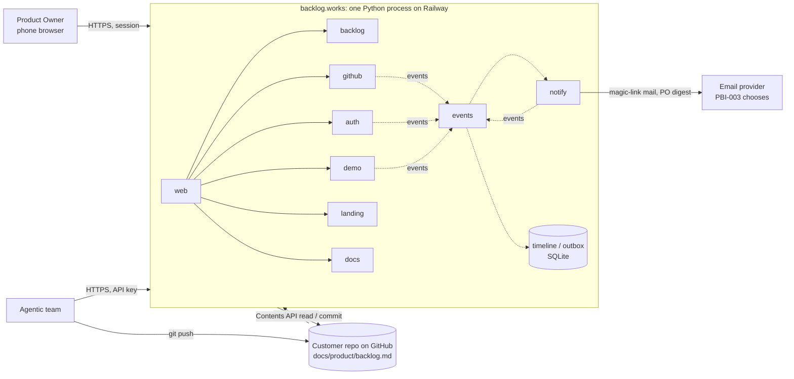
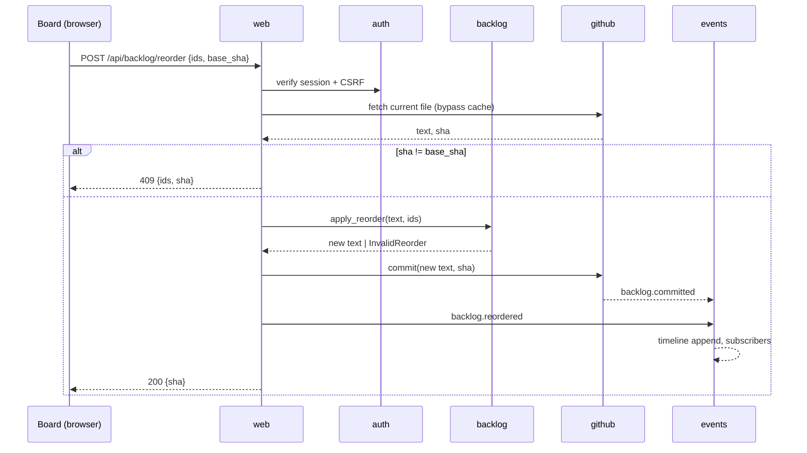

# backlog.works Architecture

One page, kept current. It records the **as-is** (deployed) shape and the
**next** shape (what PBI-001 to PBI-004 land in), as an **event-driven
modular monolith**: one process, one image, one database file, a set of
blocks that call *down* the dependency graph and talk *up and sideways only
through events*. The whole product lives in that one monolith: the app,
the public landing, and the product documentation.

`scripts/check_architecture.py` (inside `scripts/check.sh`) enforces the
block list, the import matrix, where the environment and the network may
be touched, a per-file size cap, and the root allowlist. When code and this
page disagree the gate fails and one of them is fixed in the same commit.

Why this exists before product code: Crest, the product this was extracted
from, grew two root files of 1,800 and 5,500 lines and retrofitted a
package boundary as "migration debt" before it had a paying customer. Here
the boundaries are mechanical from the first line.

## 1. Context



The backlog **file in the customer's repo is the only source of truth**.
backlog.works stores no copy of record, only identity (sessions, keys), the
event timeline, and an in-memory read cache.

## 2. Blocks

All under `src/backlogworks/`. A block is a package with a docstring that
states its responsibility; the docstring is the contract.

| Block | Responsibility | Publishes | Subscribes | As-is | Next |
|---|---|---|---|---|---|
| `config` | every env var, read once into one frozen dataclass | | | `PORT` | `BASE_URL`, `GITHUB_*`, `BACKLOG_PATH`, `SESSION_SECRET`, `DATABASE_PATH`, mail |
| `events` | `Event`, `EventBus` (sync, in-process, subscriber-isolated), audit sink; later the persisted timeline and the outbox | | | bus + stderr audit | SQLite `events` and `outbox` tables, timeline query |
| `backlog` | file format as data: parse table, legend, items; validate reorder and single-cell status change; emit new text. **Pure, no I/O, no internal imports.** | | | parse | reorder / status change (PBI-001) |
| `github` | Contents API read (ETag cache) and commit (blob `sha` guard); `push` webhook receiver | `backlog.loaded`, `backlog.committed`, `backlog.commit_conflicted`, `backlog.file_changed` | | empty | PBI-001 |
| `auth` | magic-link sign-in, PO session cookie, CSRF, per-repo API keys; owns its tables | `auth.signin_requested`, `auth.signed_in`, `auth.signed_out`, `auth.key_issued`, `auth.key_revoked`, `auth.key_used` | | empty | PBI-003, PBI-004 |
| `notify` | outbound mail via outbox with retries; never called directly | `notify.sent`, `notify.failed` | `auth.signin_requested`, `backlog.item_status_changed` | empty | PBI-003 |
| `demo` | fictitious tenant `demo/lighthouse` packaged with the image, for showing the board before a real tenant exists | `backlog.loaded` | | live at `/demo` | hidden once a tenant is configured |
| `landing` | public `/` and pitch pages | | | placeholder + link to demo | PBI-006 (Brand and landing page) |
| `docs` | product documentation at `/docs/*` from markdown packaged in the image | | | empty | first page with PBI-004 (API reference) |
| `web` | routes, server-rendered pages, JSON endpoints, headers, CSRF check; the only place blocks meet | `backlog.reordered`, `backlog.item_status_changed` | | `/`, `/healthz`, `/demo` | board, API, sign-in routes |
| `__main__` | composition root: build bus, subscribe consumers, start server | `service.started` | | | |

### Dependency rule (enforced)

```
__main__ -> config events web notify auth github        (wiring only)
web      -> backlog github auth demo landing docs events config
github   -> backlog events config
demo     -> backlog events config
auth     -> events config
notify   -> events config
landing  -> config
docs     -> config
events   -> config
backlog  -> (nothing)
config   -> (nothing)
```

Direct calls go down this list. Anything that would need to go up or
sideways (auth wanting mail sent, github wanting the cache dropped, web
wanting a timeline entry) is an event instead. `web` is the only block that
imports more than two others, on purpose: it is the composition surface
for a request, as `__main__` is for the process.

## 3. Event model

- **Events are facts, past tense, immutable, JSON-able**:
  `Event(name, payload, actor, repo, occurred_at)`. `repo` is the tenant.
  `actor` is `system`, `po:<session id>` or `agent:<key id>`.
- **Commands are plain function calls** into a block (`reorder(...)`,
  `request_signin(...)`). The block performs its primary effect, then
  publishes. There is no command bus; the call stack is the command.
- **Dispatch is synchronous in the publishing thread.** Subscribers are
  isolated: an exception is logged as `events.handler_failed` and never
  fails the command. Ordering within one publish is subscription order.
- **Persistence (next):** every event is appended to the `events` table
  before subscribers run. That table is the product's timeline ("what
  happened to PBI-003 and who did it") and the audit log. Nothing is ever
  updated or deleted in it.
- **External effects go through an outbox (next):** `notify` writes a row
  in the same transaction as the event; a dispatcher thread drains it with
  backoff. At-least-once delivery without a broker. Idempotency keys on the
  row.
- **Inbound events:** the GitHub `push` webhook becomes
  `backlog.file_changed`; subscribers drop the read cache and write the
  timeline entry, which is how an agent's plain `git push` shows up on the
  Product Owner's phone without polling.
- **No broker, no async framework, no second process** until an event
  consumer needs more than one process worth of work. Revisit trigger is in
  the decisions log.

### Event catalogue (next state)

| Event | Payload | Produced by | Consumed by |
|---|---|---|---|
| `service.started` | port | `__main__` | audit |
| `backlog.loaded` | source, sha, items, problems | github, demo | audit |
| `backlog.file_changed` | sha, commit, author | github (webhook) | github cache, timeline |
| `backlog.reordered` | moved ids, base_sha, new_sha | web | timeline |
| `backlog.item_status_changed` | id, from, to, new_sha | web | timeline, notify (to PO when an agent moves to review) |
| `backlog.committed` / `backlog.commit_conflicted` | sha(s) | github | timeline |
| `auth.signin_requested` | email hash, token id | auth | notify |
| `auth.signed_in` / `auth.signed_out` | session id | auth | timeline |
| `auth.key_issued` / `auth.key_revoked` / `auth.key_used` | key id, route | auth | timeline |
| `notify.sent` / `notify.failed` | outbox id, kind, attempt | notify | audit |
| `events.handler_failed` | for, handler, error | events | audit |

### Sequence: Product Owner reorders from the phone (next)



The agent path is identical with `A` verifying an API key. Same validation,
same events, different actor.

## 4. Storage (next)

One SQLite file on a Railway volume, `DATABASE_PATH`. Table ownership is
per block and enforced by convention (each block has its own `schema.py`
and never reads another block's tables):

- `events` (events): append-only timeline and audit.
- `outbox` (notify): pending external effects, attempts, last error.
- `sessions`, `magic_links`, `api_keys` (auth): all with a `repo` column
  from day one, so a second tenant is configuration, not a rewrite.

No backlog content at rest. A restart loses only the in-memory read cache.

## 5. Rules

1. **Stdlib only** until a dependency is approved by the Product Owner in a
   report. A product holding a write token to customer repos keeps its
   supply-chain surface at zero.
2. **One process, one image, one config dataclass.** `os.environ` is read
   only in `config.py` (gate). Network modules only in `github`, `notify`,
   and the server binding in `web` (gate).
3. **The dependency rule is law** (gate). A new block is a row in section
   2, a package docstring, and an entry in the checker, in one commit.
4. **Up or sideways means an event.** No block calls a block it may not
   import; it publishes. No block sends mail, writes the timeline, or drops
   a cache on behalf of another.
5. **File size cap 600 lines** per Python file (gate). Split by
   responsibility.
6. **Root allowlist** (gate): `AGENTS.md`, `CLAUDE.md`, `Dockerfile`,
   `LICENSE`, `README.md`, `railway.json`, `.gitignore`; code in `src/`,
   tests in `tests/<block>/`, tooling in `scripts/`.
7. **Writes are validated twice**: `backlog` refuses any change beyond the
   requested operation; GitHub's `sha` refuses stale bases. Direct commit
   to the configured branch, single-file blast radius, same path for
   humans and agents.
8. **Tests are `unittest`, no sockets** (patch `urllib`), one directory per
   block, run by `scripts/check.sh`.
9. **The format contract** is what `backlog.parse_backlog` accepts:
   first contiguous `| PBI-` block, `| PBI-<n>[a-z]. Title | Core Job |
   Context | Status[<br>note] | Driver |`, legend as in the file's callout.
   The repo's own `docs/product/backlog.md` is checked by the same code.
10. **Secrets** never in repo, image, logs, or events (hash emails, log key
    ids not keys). See `.agents/skills/backlog-works-secrets/SKILL.md`.

## 6. Decisions log

| Date | Decision | Why | Revisit when |
|---|---|---|---|
| 2026-09-25 | Event-driven modular monolith: down-calls plus in-process events, enforced matrix | decoupling without operational cost; Crest's retrofit lesson | a consumer needs more than one process |
| 2026-09-25 | Landing and product docs are blocks in the same monolith | one deploy, one version, docs never lag code | marketing needs its own release cadence |
| 2026-09-25 | Source of truth is the customer's file via GitHub Contents API, direct commit | product thesis (README "Why"); no sync problem | customers want PR-based review of backlog edits |
| 2026-09-25 | Synchronous dispatch, isolated subscribers, no broker | simplest thing that keeps the event contract honest | a subscriber's latency hurts a request |
| 2026-09-25 | Append-only `events` table is both timeline feature and audit log | one mechanism, product value from day one | volume needs partitioning |
| 2026-09-25 | Outbox pattern for mail | at-least-once without a queue service | second external effect type |
| 2026-09-25 | Stdlib only, Python 3.12 image | supply-chain surface; deploy path proven | a named need |
| 2026-09-25 | SQLite on a Railway volume, per-block table ownership | one process, tiny write volume | multi-instance or multi-region |
| 2026-09-25 | Single-tenant first, `repo` column everywhere | ship PBI-001..004 without a rewrite | second customer repo |
| 2026-09-25 | `demo` block with a fictitious packaged backlog | show the board before GitHub source and sign-in exist | first real tenant configured |

## 7. Known debt

- Bitwarden helper borrowed from Crest's checkout (see `backlog-works-secrets`
  skill); a repo-local helper is due when the second secret appears.
- `events` has no persistence yet; the timeline and outbox arrive with the
  first block that needs them (PBI-003).
